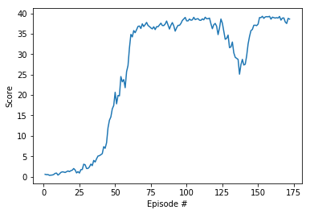

# Udacity-DRL-Continuous-Control

This Notebook and the generated report are my implementation of the second Udacity project.

You will find comments per cell block and comments along the code to explain the implementation. As suggested by Udacity, you can already use their provided code for DDPG and their neural network implementation. Simple adjustments are then made to adapt this code to work with implementation for Unity ml-agent as their initial code is done for Gym environments.
However, the neural network and hyperparameters needed a lot of tuning as discussed at the end.

Have fun reading through the code and results. I have solved the environment within 252 Episodes with +30 reward averaged over 100 episodes as required. Future plans are discussed at the end of the report.

The below info is an overview of the project as described by Udacity including all installation and setup.

# DRL - DDPG Algorithm - Reacher Continuous Control
Udacity Deep Reinforcement Learning Nanodegree Program - Reacher Continuous Control

## Introduction
In this environment, a double-jointed arm can move to target locations. A reward of +0.1 is provided for each step that the agent's hand is in the goal location. Thus, the goal of your agent is to maintain its position at the target location for as many time steps as possible.

The observation space consists of 33 variables corresponding to the position, rotation, velocity, and angular velocities of the arm. Each action is a vector with four numbers, corresponding to torque applicable to two joints. Every entry in the action vector should be a number between -1 and 1.

### The Environment
For this project, we will provide you with two separate versions of the Unity environment:

    The first version contains a single agent.
    The second version contains 20 identical agents, each with its copy of the environment.

The second version is useful for algorithms like PPO, A3C, and D4PG that use multiple (non-interacting, parallel) copies of the same agent to distribute the task of gathering experience. 

### Project Objectives
Note that your project submission need only solve one of the two versions of the environment.
Option 1: Solve the First Version

The task is episodic, and to solve the environment, your agent must get an average score of +30 over 100 consecutive episodes.
Option 2: Solve the Second Version

The barrier to solving the second version of the environment is slightly different, to take into account the presence of many agents. In particular, your agents must get an average score of +30 (over 100 consecutive episodes, and overall agents). Specifically,

    After each episode, we add up the rewards that each agent received (without discounting), to get a score for each agent. This yields 20 (potentially different) scores. We then take the average of these 20 scores.
    This yields an average score for each episode (where the average is over all 20 agents).

As an example, consider the plot below, where we have plotted the average score (overall 20 agents) obtained with each episode

The environment is considered solved when the average (over 100 episodes) of those average scores is at least +30. In the case of the plot above, the environment was solved at episode 63, since the average of the average scores from episodes 64 to 163 (inclusive) was greater than +30.

## Getting Started:

This are the instructions from the Udacity but adjusted to fit this repo.

### Unity Environment
Unity Machine Learning Agents (ML-Agents) is an open-source Unity plugin that enables games and simulations to serve as environments for training intelligent agents.

For game developers, these trained agents can be used for multiple purposes, including controlling NPC behavior (in a variety of settings such as multi-agent and adversarial), automated testing of the game builds and evaluating different game design decisions pre-release.

In this course, you will use Unity's rich environments to design, train, and evaluate your own deep reinforcement learning algorithms. You can read more about ML-Agents by perusing the [GitHub repository](https://github.com/Unity-Technologies/ml-agents).

### The Environment
Follow the instructions below to explore the environment on your own machine! You will also learn how to use the Python API to control your agent.

#### Step 1: Activate the Environment
If you haven't already, please follow the instructions in the DRLND [GitHub repository](https://github.com/udacity/deep-reinforcement-learning#dependencies) to set up your Python environment. These instructions can be found in README.md at the root of the repository. By following these instructions, you will install PyTorch, the ML-Agents toolkit, and a few more Python packages required to complete the project.

(For Windows users) The ML-Agents toolkit supports Windows 10. While it might be possible to run the ML-Agents toolkit using other versions of Windows, it has not been tested on other versions. Furthermore, the ML-Agents toolkit has not been tested on a Windows VM such as Bootcamp or Parallels.

#### Step 2: Download the Unity Environment
For this project, you will not need to install Unity - this is because we have already built the environment for you, and you can download it from one of the links below. You need only select the environment that matches your operating system:

Version 1: One (1) Agent
Linux: [click here](https://s3-us-west-1.amazonaws.com/udacity-drlnd/P2/Reacher/one_agent/Reacher_Linux.zip)
Mac OSX: [click here](https://s3-us-west-1.amazonaws.com/udacity-drlnd/P2/Reacher/one_agent/Reacher.app.zip)
Windows (32-bit): [click here](https://s3-us-west-1.amazonaws.com/udacity-drlnd/P2/Reacher/one_agent/Reacher_Windows_x86.zip)
Windows (64-bit): [click here](https://s3-us-west-1.amazonaws.com/udacity-drlnd/P2/Reacher/one_agent/Reacher_Windows_x86_64.zip)
Version 2: Twenty (20) Agents
Linux: [click here](https://s3-us-west-1.amazonaws.com/udacity-drlnd/P2/Reacher/Reacher_Linux.zip)
Mac OSX: [click here](https://s3-us-west-1.amazonaws.com/udacity-drlnd/P2/Reacher/Reacher.app.zip)
Windows (32-bit): [click here](https://s3-us-west-1.amazonaws.com/udacity-drlnd/P2/Reacher/Reacher_Windows_x86.zip)
Windows (64-bit): [click here](https://s3-us-west-1.amazonaws.com/udacity-drlnd/P2/Reacher/Reacher_Windows_x86_64.zip)
Then, place the file in this root folder, and unzip (or decompress) the file.

#### Step 3: Explore the Environment
After you have followed the instructions above, open Continuous_Control.ipynb and follow the instructions to learn how to use the Python API to control the agent.

