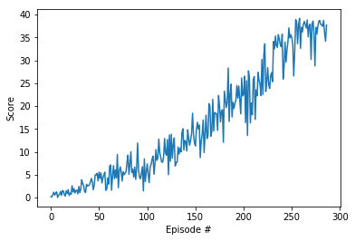
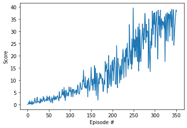

# Project 2

---

This Notebook and the generated pdf report are my implementation of the second Udacity project.
This Notebook was ran on Udacity workspace with GPU support.

Note that the entire training took 2 hours.

You will find comments per cell block and comments along the code (ddpg_agent.py and model.py) to explain the implementation. As suggested by Udacity, you can already use their provided code for DDPG and their neural network implementation. Simple adjustments are then made to adapt this code to work with implementation for Unity ml-agent as their initial code is done for Gym environments.
However, the neural network and hyperparameters needed a lot of tuning as discussed at the end.

Have fun reading through the code and results. I have solved the environment within 187 Episodes with +30 reward averaged over 100 episodes as required. Future plans are discussed at the end of the report.

# Continuous Control

---

In this notebook, you will learn how to use the Unity ML-Agents environment for the second project of the [Deep Reinforcement Learning Nanodegree](https://www.udacity.com/course/deep-reinforcement-learning-nanodegree--nd893) program.

### 1. Start the Environment

We begin by importing the necessary packages.  If the code cell below returns an error, please revisit the project instructions to double-check that you have installed [Unity ML-Agents](https://github.com/Unity-Technologies/ml-agents/blob/master/docs/Installation.md) and [NumPy](http://www.numpy.org/).


```python
!pip -q install ./python
```

    tensorflow 1.7.1 has requirement numpy>=1.13.3, but you'll have numpy 1.12.1 which is incompatible.
    ipython 6.5.0 has requirement prompt-toolkit<2.0.0,>=1.0.15, but you'll have prompt-toolkit 3.0.36 which is incompatible.
    jupyter-console 6.4.3 has requirement jupyter-client>=7.0.0, but you'll have jupyter-client 5.2.4 which is incompatible.


Next, we will start the environment!  **_Before running the code cell below_**, change the `file_name` parameter to match the location of the Unity environment that you downloaded.

- **Mac**: `"path/to/Reacher.app"`
- **Windows** (x86): `"path/to/Reacher_Windows_x86/Reacher.exe"`
- **Windows** (x86_64): `"path/to/Reacher_Windows_x86_64/Reacher.exe"`
- **Linux** (x86): `"path/to/Reacher_Linux/Reacher.x86"`
- **Linux** (x86_64): `"path/to/Reacher_Linux/Reacher.x86_64"`
- **Linux** (x86, headless): `"path/to/Reacher_Linux_NoVis/Reacher.x86"`
- **Linux** (x86_64, headless): `"path/to/Reacher_Linux_NoVis/Reacher.x86_64"`

For instance, if you are using a Mac, then you downloaded `Reacher.app`.  If this file is in the same folder as the notebook, then the line below should appear as follows:
```
env = UnityEnvironment(file_name="Reacher.app")
```


```python
from unityagents import UnityEnvironment
import numpy as np

# select this option to load version 1 (with a single agent) of the environment
env = UnityEnvironment(file_name='/data/Reacher_One_Linux_NoVis/Reacher_One_Linux_NoVis.x86_64')

# select this option to load version 2 (with 20 agents) of the environment
# env = UnityEnvironment(file_name='/data/Reacher_Linux_NoVis/Reacher.x86_64')
```

    INFO:unityagents:
    'Academy' started successfully!
    Unity Academy name: Academy
            Number of Brains: 1
            Number of External Brains : 1
            Lesson number : 0
            Reset Parameters :
    		goal_size -> 5.0
    		goal_speed -> 1.0
    Unity brain name: ReacherBrain
            Number of Visual Observations (per agent): 0
            Vector Observation space type: continuous
            Vector Observation space size (per agent): 33
            Number of stacked Vector Observation: 1
            Vector Action space type: continuous
            Vector Action space size (per agent): 4
            Vector Action descriptions: , , , 
    

Environments contain **_brains_** which are responsible for deciding the actions of their associated agents. Here we check for the first brain available, and set it as the default brain we will be controlling from Python.


```python
# get the default brain
brain_name = env.brain_names[0]
brain = env.brains[brain_name]
```

### 2. Examine the State and Action Spaces

In this environment, a double-jointed arm can move to target locations. A reward of `+0.1` is provided for each step that the agent's hand is in the goal location. Thus, the goal of your agent is to maintain its position at the target location for as many time steps as possible.

The observation space consists of `33` variables corresponding to position, rotation, velocity, and angular velocities of the arm.  Each action is a vector with four numbers, corresponding to torque applicable to two joints.  Every entry in the action vector must be a number between `-1` and `1`.

Run the code cell below to print some information about the environment.


```python
# reset the environment
env_info = env.reset(train_mode=True)[brain_name]

# number of agents
num_agents = len(env_info.agents)
print('Number of agents:', num_agents)

# size of each action
action_size = brain.vector_action_space_size
print('Size of each action:', action_size)

# examine the state space 
states = env_info.vector_observations
state_size = states.shape[1]
print('There are {} agents. Each observes a state with length: {}'.format(states.shape[0], state_size))
print('The state for the first agent looks like:', states[0])
```

    Number of agents: 1
    Size of each action: 4
    There are 1 agents. Each observes a state with length: 33
    The state for the first agent looks like: [  0.00000000e+00  -4.00000000e+00   0.00000000e+00   1.00000000e+00
      -0.00000000e+00  -0.00000000e+00  -4.37113883e-08   0.00000000e+00
       0.00000000e+00   0.00000000e+00   0.00000000e+00   0.00000000e+00
       0.00000000e+00   0.00000000e+00  -1.00000000e+01   0.00000000e+00
       1.00000000e+00  -0.00000000e+00  -0.00000000e+00  -4.37113883e-08
       0.00000000e+00   0.00000000e+00   0.00000000e+00   0.00000000e+00
       0.00000000e+00   0.00000000e+00   5.75471878e+00  -1.00000000e+00
       5.55726671e+00   0.00000000e+00   1.00000000e+00   0.00000000e+00
      -1.68164849e-01]
    

### 3. Take Random Actions in the Environment

In the next code cell, you will learn how to use the Python API to control the agent and receive feedback from the environment.

Once this cell is executed, you will watch the agent's performance, if it selects an action at random with each time step.  A window should pop up that allows you to observe the agent, as it moves through the environment.  

Of course, as part of the project, you'll have to change the code so that the agent is able to use its experience to gradually choose better actions when interacting with the environment!


```python
# env_info = env.reset(train_mode=False)[brain_name]     # reset the environment    
# states = env_info.vector_observations                  # get the current state (for each agent)
# scores = np.zeros(num_agents)                          # initialize the score (for each agent)
# while True:
#     actions = np.random.randn(num_agents, action_size) # select an action (for each agent)
#     actions = np.clip(actions, -1, 1)                  # all actions between -1 and 1
#     env_info = env.step(actions)[brain_name]           # send all actions to tne environment
#     next_states = env_info.vector_observations         # get next state (for each agent)
#     rewards = env_info.rewards                         # get reward (for each agent)
#     dones = env_info.local_done                        # see if episode finished
#     scores += env_info.rewards                         # update the score (for each agent)
#     states = next_states                               # roll over states to next time step
#     if np.any(dones):                                  # exit loop if episode finished
#         break
# print('Total score (averaged over agents) this episode: {}'.format(np.mean(scores)))
```

When finished, you can close the environment.


```python
# don't close the environment in the middle as you will need to restart the kernel
# env.close()
```

### 4. It's Your Turn!

Now it's your turn to train your own agent to solve the environment!  When training the environment, set `train_mode=True`, so that the line for resetting the environment looks like the following:
```python
env_info = env.reset(train_mode=True)[brain_name]
```


```python
import random
import torch
import numpy as np
from collections import deque
import matplotlib.pyplot as plt
%matplotlib inline

from ddpg_agent import Agent, ReplayBuffer
```


```python
# load the same agent from Udacity's DDPG with this env state and action sizes
agent = Agent(state_size=33, action_size=4, random_seed=15320)
```


```python
def ddpg(n_episodes=1000, max_t=1000):

    scores = []                        # list containing scores from each episode
    scores_window = deque(maxlen=100)  # last 100 scores
    
    for i_episode in range(1, n_episodes+1):
        
        # resetting the environment and all agents for each episode and getting their initial state
        env_info = env.reset(train_mode=True)[brain_name]     # reset the environment    
        states = env_info.vector_observations                  # get the current state (for each agent)
        score = np.zeros(num_agents)                          # initialize the score (for each agent)
        agent.reset()
        
        for t in range(max_t):
#             print(t)    
            actions = agent.act(states)                        # select an action (for each agent)
            env_info = env.step(actions)[brain_name]           # send all actions to the environment
            next_states = env_info.vector_observations         # get next state (for each agent)
            rewards = env_info.rewards                         # get reward (for each agent)
            dones = env_info.local_done                        # see if episode finished
            
#             agent.step(states, actions, rewards, next_states, dones) #updating the experience replay and updating weights of the learning model for all agents
            
            for state, action, reward, next_state, done in zip(states, actions, rewards, next_states, dones):
                agent.step(state, action, reward, next_state, done) #updating the experience replay and updating weights of the learning model for all agents
            
            
            states = next_states                               # roll over states to next time step
            score += rewards[0]                         # update the score (for each agent)
            
            
            if np.any(dones):                                  # exit loop if episode finished
                break
                
                
#         print('Total score (averaged over agents) this episode: {}'.format(np.mean(scores)))
        
        scores_window.append(score)       # save most recent score
        scores.append(score)              # save most recent score
        
#         print(scores_window_all_agents)
        
#         print('\rEpisode {}\tAverage Score: {:.2f}'.format(i_episode, np.mean(scores_window)), end="")
        print('\rEpisode {}\tAverage Score: {:.2f}\tScore: {:.2f}'.format(i_episode, np.mean(scores_window), np.mean(score)), end="")
        
        
        if i_episode % 5 == 0:
            
            torch.save(agent.actor_local.state_dict(), 'checkpoint_actor_lr_e-5.pth')
            torch.save(agent.critic_local.state_dict(), 'checkpoint_critic_lr_e-5.pth')
            
        if np.mean(scores_window) >= 30.0:
            print('\nEnvironment solved in {:d} episodes!\tAverage Score: {:.2f}'.format(i_episode - 100, np.mean(scores_window)))
            torch.save(agent.actor_local.state_dict(), 'checkpoint_actor_lr_e-5.pth')
            torch.save(agent.critic_local.state_dict(), 'checkpoint_critic_lr_e-5.pth')
            break
    

    return scores
```


```python
scores = ddpg()
```

    Episode 287	Average Score: 30.06	Score: 37.68
    Environment solved in 187 episodes!	Average Score: 30.06
    


```python
# plot the scores
fig = plt.figure()
ax = fig.add_subplot(111)
plt.plot(np.arange(len(scores)), scores)
plt.ylabel('Score')
plt.xlabel('Episode #')
plt.show()
```


    

    


```python
env.close()
```

# Results

The above results were obtained with a learning rate of 1e-5. While the following results were obtained with a learning rate of 1e-4. With a higher learning rate, the training was slower (surprisingly not faster!) as the environment was solved in 252 episodes instead of 187 (you can find additional weights and notebook for that run in the repo). It is also more unstable as you can see with the flactuations of the reward each episode (i.e., high variance). Also when trying our with 1e-3 value for the learning rate, the model never converges. This is a quite common behavior when the neural network is too deep (i.e., have too much parameters) and thus too prone for oscillation around the desired minima or maxima. You can check this blog for more details (https://www.jeremyjordan.me/nn-learning-rate/). On the other hand having a very low learning rate can lead to being stuck in local minima/maxima, however, the used Adam optimizer can overcome that with the momentum aspect.



# Future directions

Other important factors affected the learning and its stability included the added noise to the algorithm. Thus, batch normalization was used in the neural network as well as the noise sampling technique was adjusted. This was an important step to actually start converging. A more stable algorithm in general can be used in future work such as PPO and SAC that are commonly used in Unity ml-agent examples. For more details, check the instructions readme and Unity ml-agents repo.
